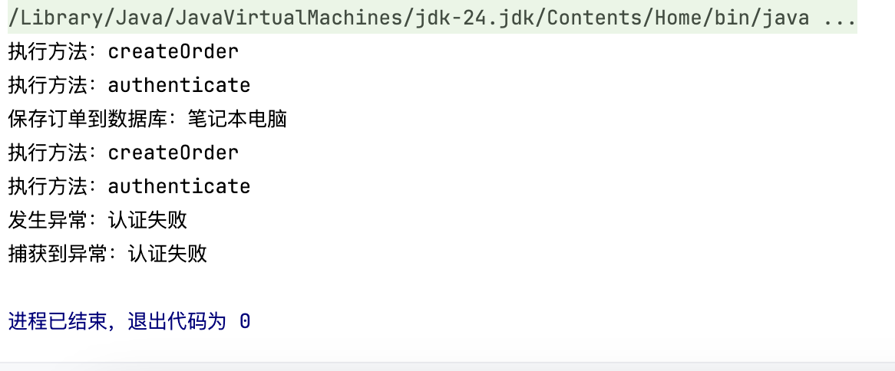

### **项目说明**
本项目是一个基于 Spring 框架的 Java 应用程序，主要用于演示订单处理的流程。
它通过 Spring 的依赖注入机制加载配置并管理组件，并通过模拟正常和异常场景来测试订单处理逻辑。

---

### **关键组件说明**

1.  **MainApp类,作为程序的入口点**  
    - 使用 `AnnotationConfigApplicationContext` 加载 Spring 配置类 `AppConfig`。获取 `OrderController` 的实例。创建一个 `Order` 对象用于测试。调用 `OrderController.processOrder` 方法，分别演示正常流程和异常流程，并捕获可能的异常
2. **AppConfig类是Spring 的配置类**
    - 其通常用于定义 Bean 和其他应用配置，定义了 `OrderController` 及其依赖的 Bean。配置了 Spring 容器的初始化逻辑
3. **OrderController类**
    - 处理订单的核心逻辑，提供 `processOrder` 方法，接收订单对象和 token 参数。根据 token 的有效性决定是否处理订单。如果 token 无效抛出异常
4. **`Order`类是表示订单的模型类，`id`是订单ID。`product`是商品名称。`amount`是商品价格**
    
---

## **代码执行流程**
1. 使用 `AnnotationConfigApplicationContext` 加载 `AppConfig` 配置类。初始化 Spring 容器并注册所有 Bean
2. 从 Spring 容器中获取 `OrderController` 的实例
3. 创建一个 `Order` 对象，包含订单ID、商品名称和价格
4. 调用 `processOrder` 方法，传入有效的 token。预期订单处理成功
5. 调用 `processOrder` 方法，传入无效的 token。预期抛出异常，并在 `catch` 块中捕获并打印异常信息
---

### **运行结果**

---
